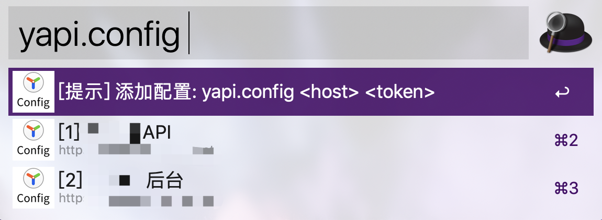

# alfred_wf_yapi

支持 yapi 搜索的 Alfred Workflow 插件


## 安装

点击下载: [alfred_wf_yapi v1.0.2 下载地址](https://github.com/chyroc/alfred_wf_yapi/releases/download/v1.0.2/yapi.1.0.2.alfredworkflow)

双击下载得到的文件，按照提示安装插件

## 使用

### 配置 yapi

> 注意：可以配置多个

输入 `⌘` + `Space` 唤出 Alfred，输入下面的命令配置 yapi

```shell script
yapi.config <yapi 服务地地址> <你自己的 token>
```



> token 在哪获取？
>
> 点击项目中的「设置」->「token 配置」，即可获取到 token

### 搜索 yapi 接口

输入 `yapi.search` 发起搜索（或者输入 `yapi` 然后选择 `yapi 搜索接口` 项）

然后输入关键字搜索，如 `登录用户信息`，结果即会展示出来（如上图所示）

选择结果中的某一项后回车，会跳转到网页中打开这个接口

## 参考

- yapi 开放 api: https://hellosean1025.github.io/yapi/openapi.html
- go alfred workflow sdk: https://github.com/deanishe/awgo
